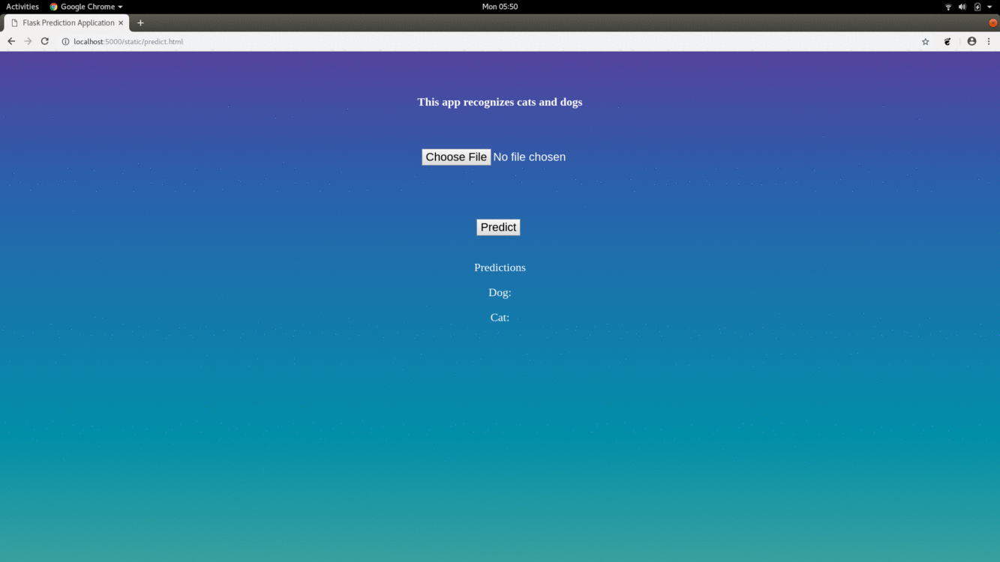

# Introduction
This flask web application uses a fine-tuned VGG_16 model to predict whether an uploaded image is a cat or a dog. The jupyter notebook in this repository has a sequence of cells that get VGG_16 model and convert it into a Sequential model with prediction output for only 2 classes: cats v dogs.
Then this Sequential model was trained on 1900 images of each class. The jupyter notebook saves this complete and reusable model into 'model.h5'. The notebook also has necessary information about directory structure for images.  This h5 file is loaded by the Flask web server and used for predictions!

## Dependencies
The project requires the following:
- python 2.7.x
- numpy 1.16.1
- tensorflow 1.12.0
- keras 2.1.2 (The latest version will cause an IO error in loading the h5py model)
- sklearn 0.20.2
- flask 1.0.2

## Run the app
1. Run all cells in the Jupyter Notebook in the project directory.
2. On terminal, run `python predict.py`. This starts a python server that listens on localhost port 5000.
3. Flask will serve the static files which can be accessed from `http://localhost:5000/static/predict.html` from browser.
4. Upload a test image and get the percentage!

## Useful Links/Documentations
* [Keras](https://keras.io/)
* [Flask](http://flask.pocoo.org/docs/1.0/)
* [Google Images Downloader](https://github.com/hardikvasa/google-images-download)

## Demonstration

## License
See [license](www.google.com)
